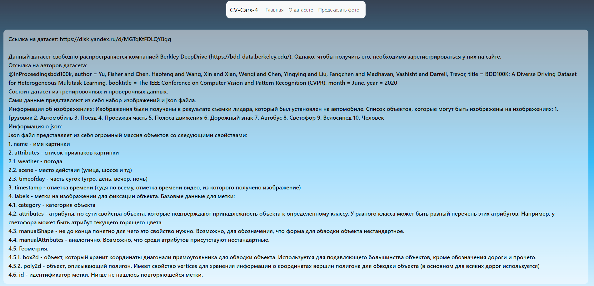
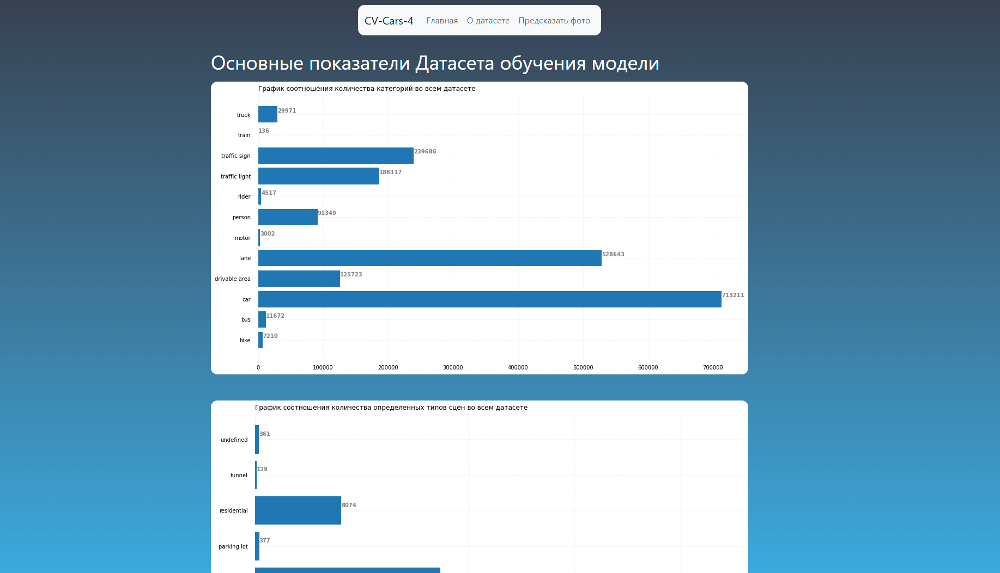
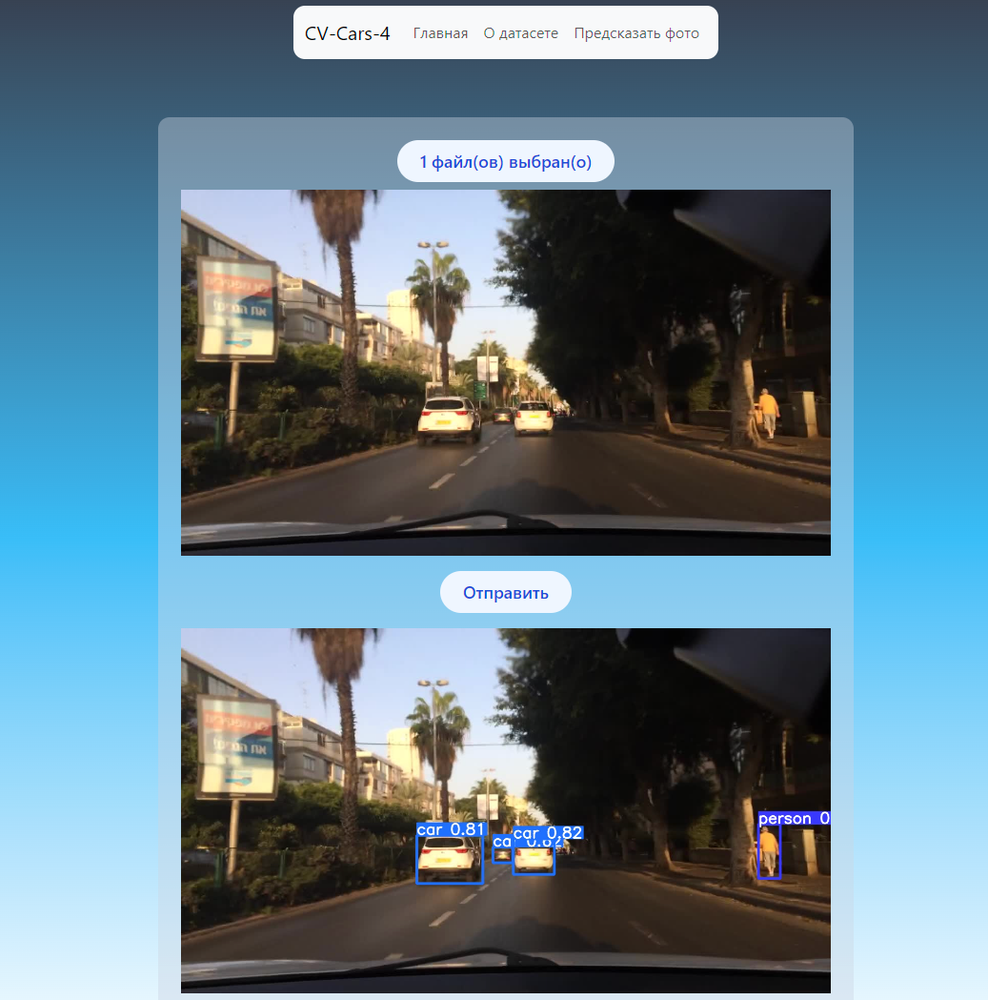
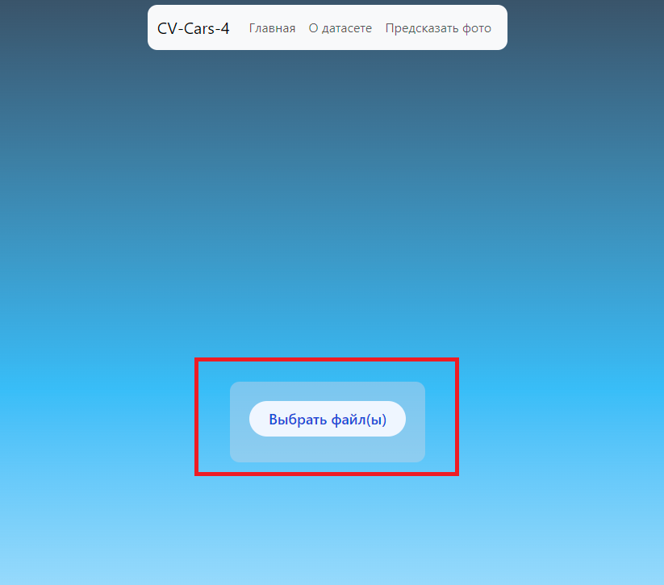
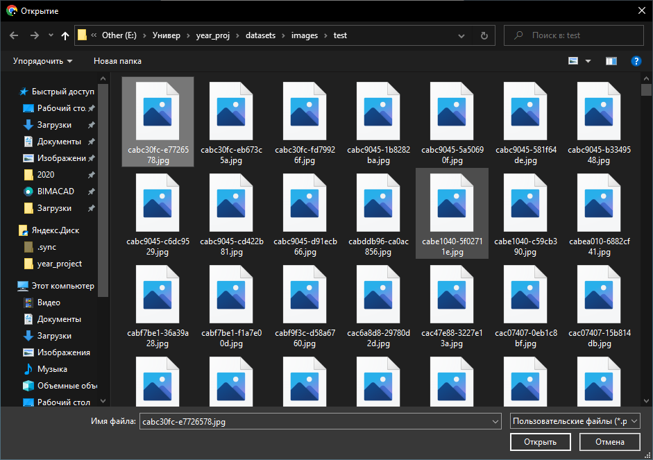
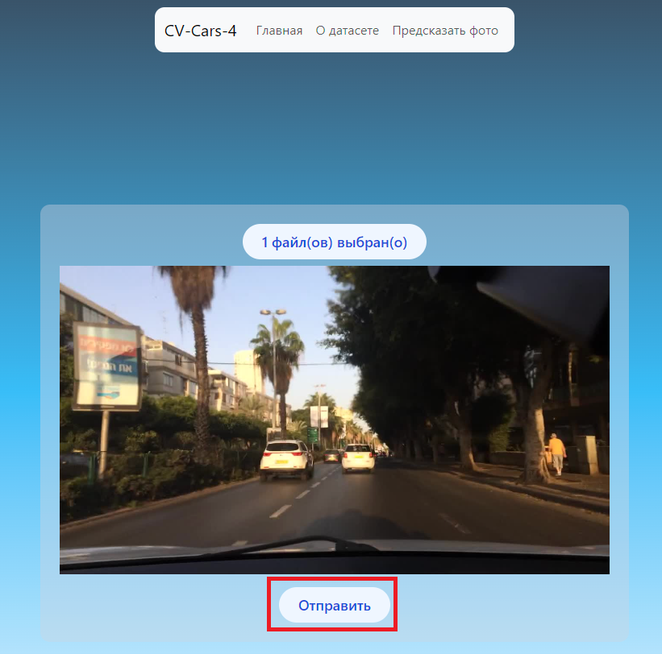
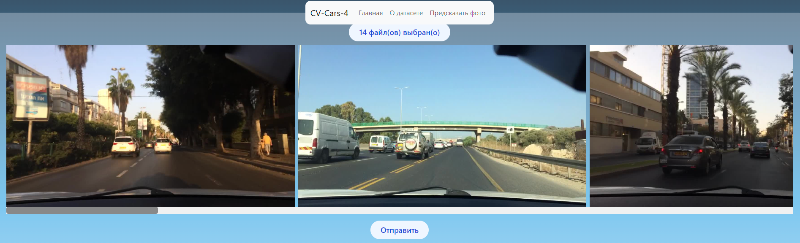
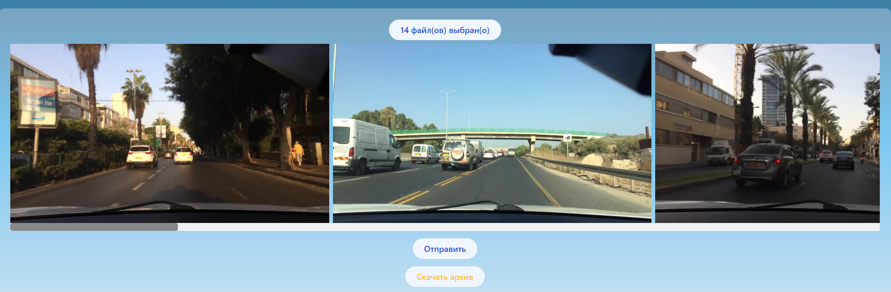
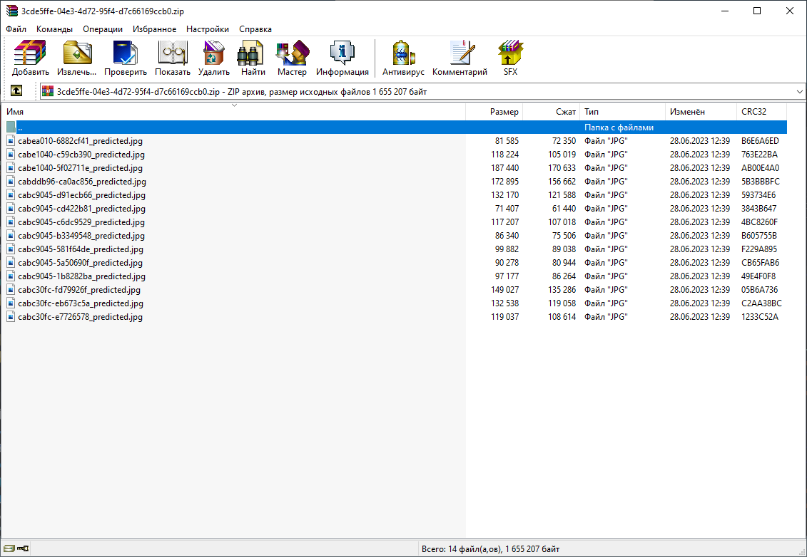
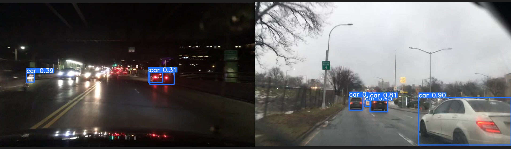

# Руководство пользователя

## Ссылка на приложение

Приложение находится по адресу: https://cv-cars-4.vercel.app/

Регистрация не требуется

## Состав приложения

На главной странице приложения находится описание использованного датасета со всеми отсылками к авторам.

Во вкладке "О датасете" отображены все статистические показатели датасета:
1. Соотношение категорий объектов 
2. Соотношение типов сцен 
3. Соотношение погод на сценах
4. Соотношение времен суток на сценах

Во вкладке "Предсказать фото" можно использовать основной функционал приложения — детекцию участников дорожного движения.

## Детекция

Для того, чтобы использовать приложение, необходимо выбрать хотя бы 1 файл, нажав кнопку "Выбрать файл(ы)":

В диалоговом окне надо выбрать картинку и нажать "Открыть"

Затем необходимо нажать кнопку "Отправить" для запуска детекции объектов.

После этого запустится предсказание и на экран выведется результаты детекции в виде изображения.

Аналогичный сценарий и для предсказания на нескольких картинках, только в диалоговом окне надо выбрать несколько картинок соответственно.

Дальше разница в том, что на вывод возвращается архив с обработанными картинками. Необходимо нажать на кнопку "Скачать архив".

